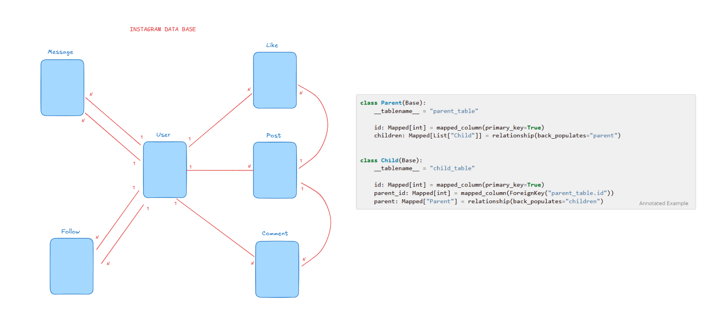

# Instagram Style Database (SQLAlchemy)

Este proyecto es una base de datos básica inspirada en una app estilo **Instagram**, desarrollada con **Python** y **SQLAlchemy**.

Incluye modelos y relaciones esenciales como:
- **Users**
- **Posts**
- **Likes**
- **Comments**
- **Follows**
- **Messages**

El objetivo principal es practicar y demostrar el diseño de relaciones entre tablas (1:N y N:N) usando ORM.

## Database Diagram

